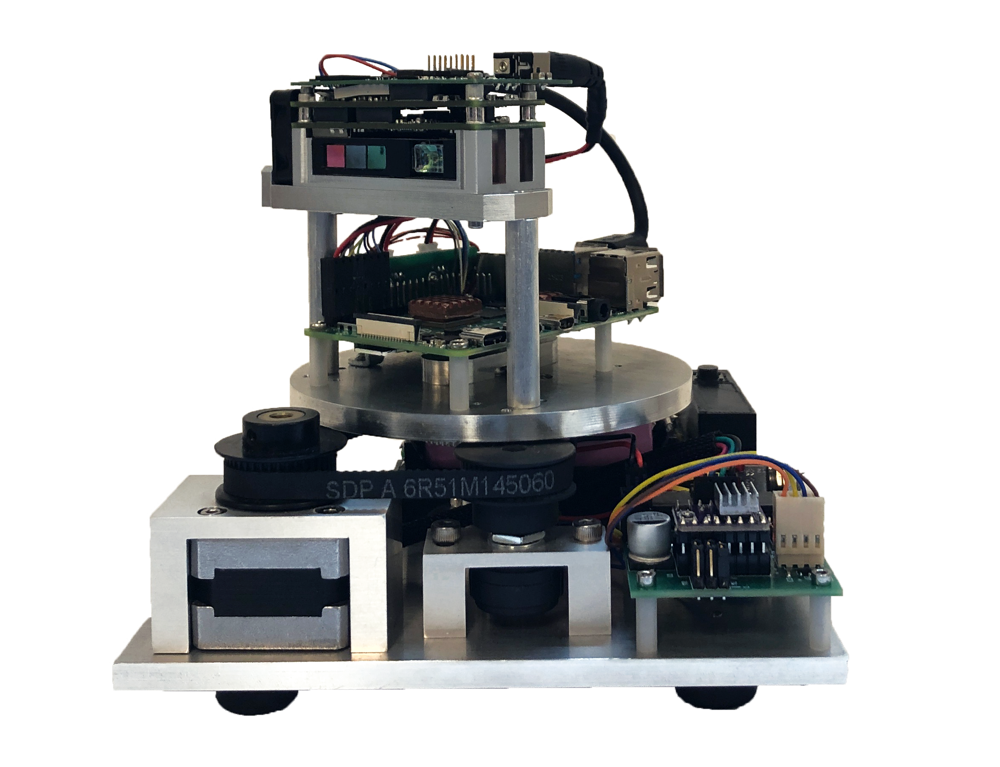
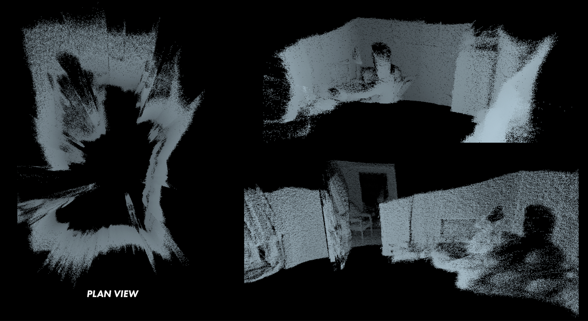

# Capstone

### To operate the system:
1. Powering on the system
    - If reinserting the batteries into the case
        - Insert batteries and with the power switch in the off position, hit the BMS reset button
        - Now toggle the power switch to the ON position
    - If batteries are already in the case from previous usage
        - Toggle the power switch to the ON position
2. SSH to the Raspberry Pi 4 (if not connected to the network yet, check the troubleshoot section below)
    - Many useful tutorials on how to do this online such as [this one](https://itsfoss.com/ssh-into-raspberry/) Start with step 2
    - User name: pi  
      Password: lasers
    - `ssh pi@192.168.0.17` Replace ip address with your specific ip address for the Pi
3. Change your directory to the capstone-slam folder
    - `cd Documents/capstone-slam`
4. Run the boot script to initialize the system
    - `./ROSBOOT.sh`
5. Now navigate to to the [website](https://lidarcapstone.com) to capture scans
6. When finished and ready to properly shutdown the system
    - `sudo shutdown`
    - Wait until the Pi has shutdown and then toggle the power switch to the OFF position

### Troubleshoot:
- If the `./ROSBOOT.sh` command does not launch the system follow the steps below
    1. Change your directory to the capstone-slam folder
        - `cd Documents/capstone-slam/RPIScannerWorkspace`
    2. Source the ROS workspace
        - `source ./devel/setup.bash`
    3. Run launch file to boot everything
        - `roslaunch rpi_stitching.launch`  
- If the Raspberry Pi is not connected to the network
    1. Connect a monitor, keyboard, and mouse to the Raspberry Pi
    2. Follow step 1 under **To operate the system** to power on the system
    3. Login to the Pi if prompted to (see step 2 under **To operate the system**)
        - Enter the command `sudo raspi-config`
        - Using the arrow keys select **Boot Options**
        - Select **Desktop Autologin**, then **OK**, then **Finished**
        - The system will reboot and you can use the interface to connect to your wifi network
        - Open a terminal and type `ifconfig` to determine your IP address (needed to establish a SSH connection)
        - In the same terminal repeat these steps to change **Desktop Autologin** back to **Console Autologin**
        - The system should now auto-boot to your network, allowing you to establish a SSH connection
- If you see console messages saying the camera is not connected or not found when it is in fact connected
    1. Unplug the LiDAR sensor power and USB connector from the LiDAR sensor
    2. Wait, 5 seconds and reinsert the power connection, followed by the USB connector
    3. You now should see the console message no longer describe a camera issue
        - Repeat step 2 if you still see console messages that the camera is not connected

---
### Website:
[3D Mapping with LiDAR](https://lidarcapstone.com)
---
### Images:

---
### Project Sponsor:
[MicroVision](http://www.microvision.com/consumer-lidar/)
